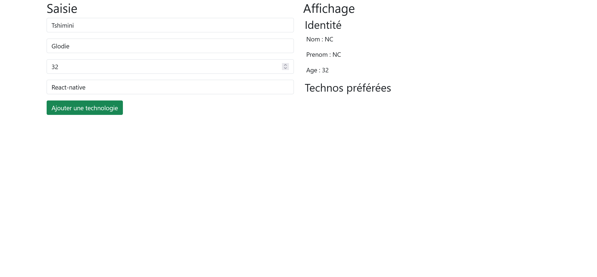

# Exercice 2 : manipulation du DOM

---

## Énoncé

1. À l'aide du DOM, créez un formulaire de contact depuis JavaScript que vous allez venir injecter dans l'élément HTML qui a l'identifiant ***\#app***
```html
<!DOCTYPE html>
<html lang="fr">
<head>
  <meta charset="UTF-8">
  <meta name="viewport" content="width=device-width, initial-scale=1.0">
  <title>Exercice 2</title>
</head>
<body>
  <div id="app"></div>
  <script src="index.js"></script>
</body>
</html>
```
2.  Toujours à l'aide du DOM, affichez les informations saisies dans le formulaire de gauche en direct sur la partie droite du document HTML, [cf. illustrustion ci-dessous](#illustration)

### Spécifications techniques

1. Faire le lien entre le HTML et le JS
2. Une techno est ajoutée à partir du bouton
3. Les langages et les technos doivent être affiché sous la forme d'une liste à puces.
4. Si l'âge est supérieur ou égal à 18 ans, affichez le message "vous êtes majeur(e)", sinon affichez "Vous êtes mineur(e)"

---

## Aide pour récupérer la valeur d'un champ input

```js
const elt = document.querySelector('#firstname')
elt.addEventListener('input', (evt) => {
  const inputValue = evt.target.value
})
```

---

## Bonus

1. Désactivez le bouton "ajouter une technologie" lorsque le champ de saisie de la techno est vide.
2. Ajoutez des boutons de suppression aux technos ajoutées.

---

## Illustration



