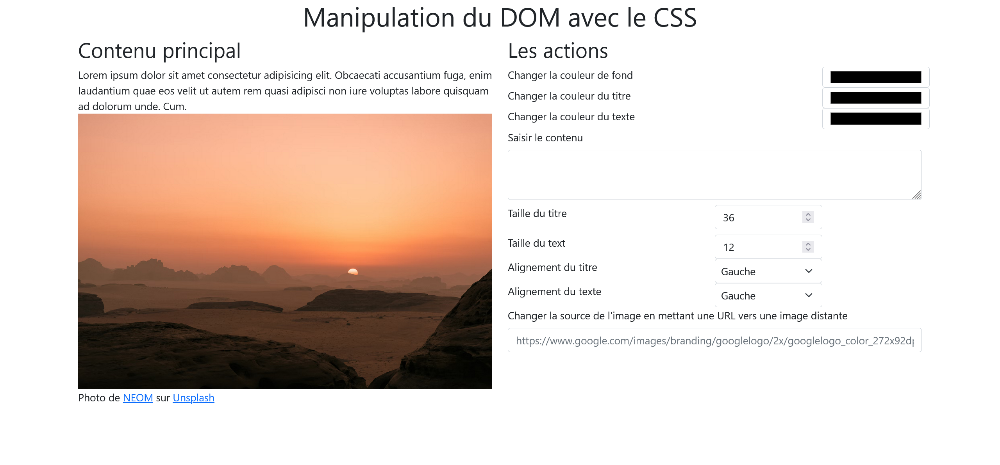

# Exercice 3 : manipulation du DOM partie JavaScript

---

## Modalités

1. Récupérez ce [code HTML](./src/ex3/index.html) qui servira de base pour l'exercice
2. Ajoutez votre JS dans ce fichier HTML
3. Avec le CSS, faites la mise en page avec FlexBox pour obtenir le résultat [ci-dessous](#maquette-de-la-page-version-desktop-bureau)
---

## Enoncé

À l'aide des événements, modifiez les propriétés CSS ou le contenu des éléments du bloc de gauche.
Les actions à effectuer :
- Modifiez la couleur de fond ;
- Modifiez les couleurs du titre et du texte ;
- Modifiez les alignements du titre et du texte ;
- Modifiez ou ajoutez du contenu au texte initial ;
- Modifiez les tailles du titre et du texte ;
 - Modifiez l’apparence du curseur au survol de l'image en affichant tout en haut de la page le message "survol de l'image" ;
 - Et tout ce qui vous passe par la tête

### Maquette de la page

